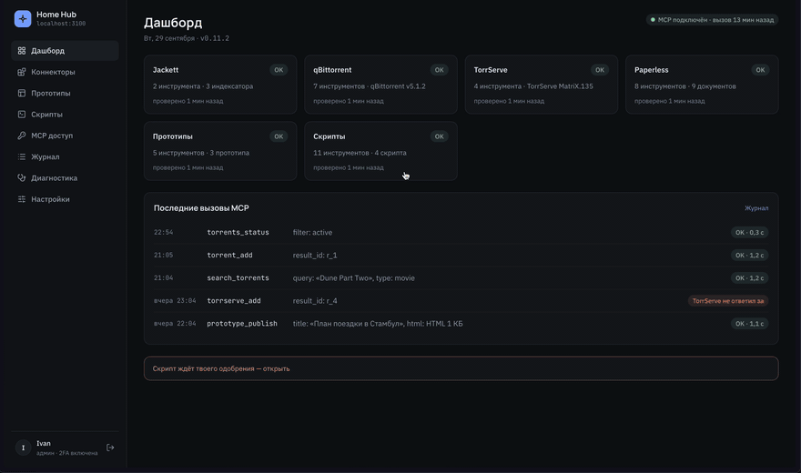

# Home MCP Hub

Self-hosted MCP-хаб, который подключает домашние сервисы к Claude и ChatGPT. Один Docker-контейнер с админкой:
ассистент ищет и качает торренты, запускает стриминг, разбирает документы, публикует HTML-прототипы и выполняет ваши скрипты.



## Что умеет

- **Коннекторы** — Jackett, qBittorrent, Transmission, TorrServe, Paperless-ngx, папки с диска (чтение, правка, перенос по режимам). Настраиваются в админке, лишние инструменты можно выключить.
- **Прототипы** — ассистент публикует HTML-страницу и отдаёт ссылку, при желании с пином и сроком жизни.
- **Скрипты** — cron-задачи и свои MCP-инструменты на JS в песочнице, с секретами, которые не видит ни скрипт, ни модель.
- **Безопасность** — OAuth 2.1 с PKCE и обязательной 2FA для входа, секретный префикс пути, шифрование паролей сервисов, журнал всех вызовов.
- **Инструкции для ассистента** — у каждого коннектора свой текст, который можно дополнить или заменить; что уходит модели — на экране «Диагностика».

## Запуск в Docker

`docker-compose.yml`:

```yaml
services:
  hub:
    image: ghcr.io/ivan-kuzmichev/home-mcp-hub:latest   # или закрепить версию: :0.11
    restart: unless-stopped
    env_file: .env
    environment:
      DATABASE_PATH: /data/hub.db
      TZ: Europe/Moscow
    ports:
      - '3000:3000'
    volumes:
      - ./data:/data
```

`.env` рядом (`chmod 600 .env`):

```bash
BASE_URL=https://hub.example.com        # публичный адрес, без префикса; MCP работает только по https
HUB_MASTER_KEY=                         # openssl rand -hex 32 — шифрует пароли сервисов
BETTER_AUTH_SECRET=                     # openssl rand -base64 32
ADMIN_EMAIL=you@example.com
ADMIN_PASSWORD=                         # от 12 символов, нужен только при первом старте
TRUST_PROXY=1                           # хаб за реверс-прокси (Traefik, Caddy, Pangolin…)
```

```bash
docker compose up -d
docker compose logs hub | grep "Admin panel"   # адрес админки с секретным префиксом, печатается один раз
```

Дальше:

1. Открыть адрес из лога, войти и настроить 2FA — без неё админка не пустит.
2. «Коннекторы» — указать адреса сервисов, например `http://qbittorrent:8080`, если хаб в одной docker-сети с ними.
3. «MCP доступ» — скопировать MCP URL и включить регистрацию клиентов:
   - **Claude** → Settings → Connectors → Add custom connector → URL, OAuth-поля пустые → Connect.
   - **ChatGPT** → Плагины → Добавить → Создать MCP-приложение → URL, аутентификация OAuth → Создать.
4. Войти, ввести код 2FA, нажать «Разрешить». В новом чате попросить `вызови hub_status`.

Обновление — `docker compose pull && docker compose up -d`, миграции базы применяются при старте.
Всё состояние хранится в `./data`, бэкап и остальное — в [docs/deployment.md](docs/deployment.md).

## Документация

- [Развёртывание](docs/deployment.md) — реверс-прокси, сеть хоста, образы и версии, автообновление, бэкап
- [Коннекторы и инструменты](docs/connectors.md) — что умеет каждый коннектор, инструкции, Paperless, скрипты и свои инструменты
- [Безопасность](docs/security.md) — как закрыты вход, OAuth, префикс, секреты и прототипы
- [Разработка](docs/development.md) — локальный запуск, проверки, релизы

## Лицензия

[MIT](LICENSE)
