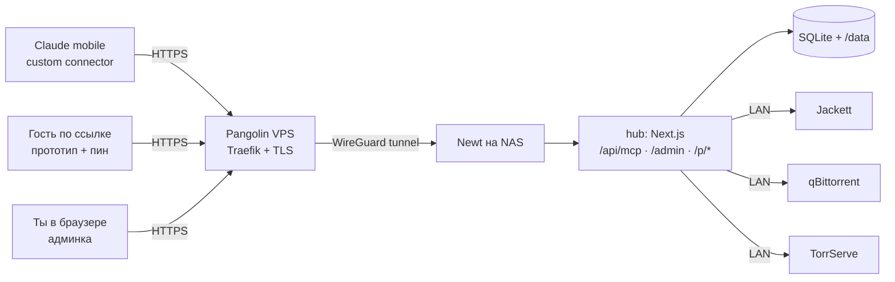
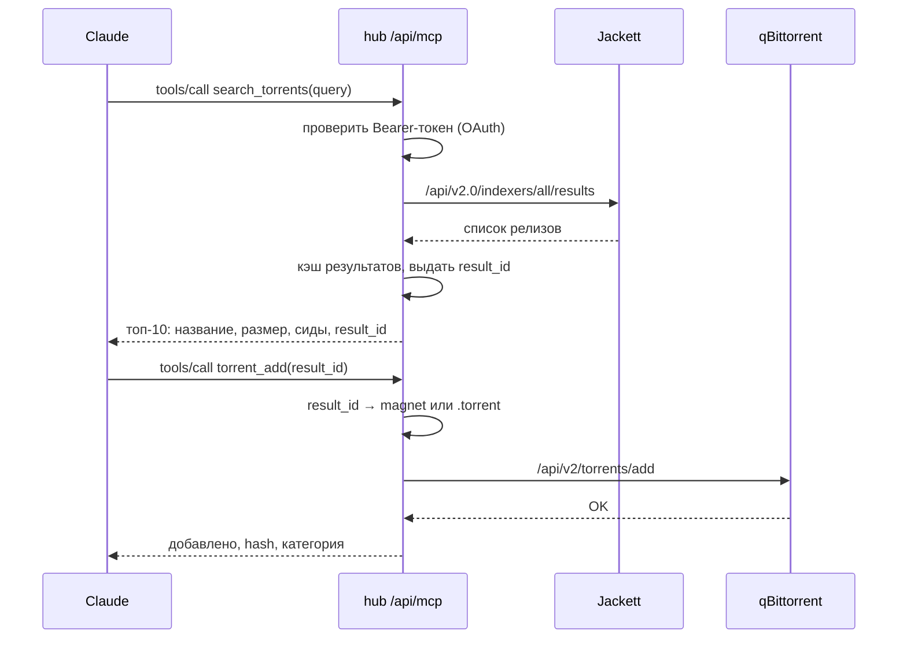
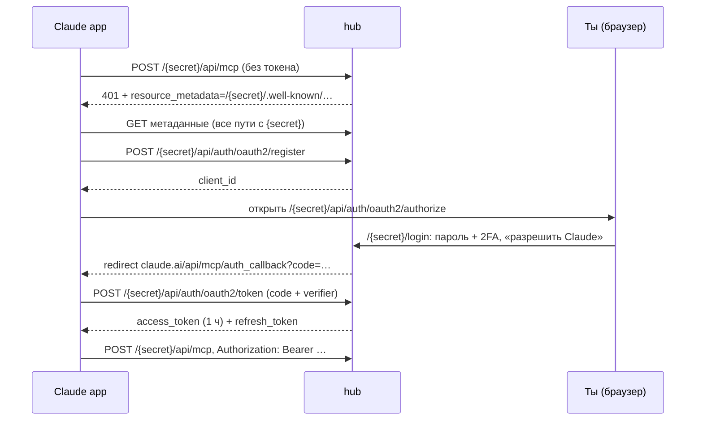
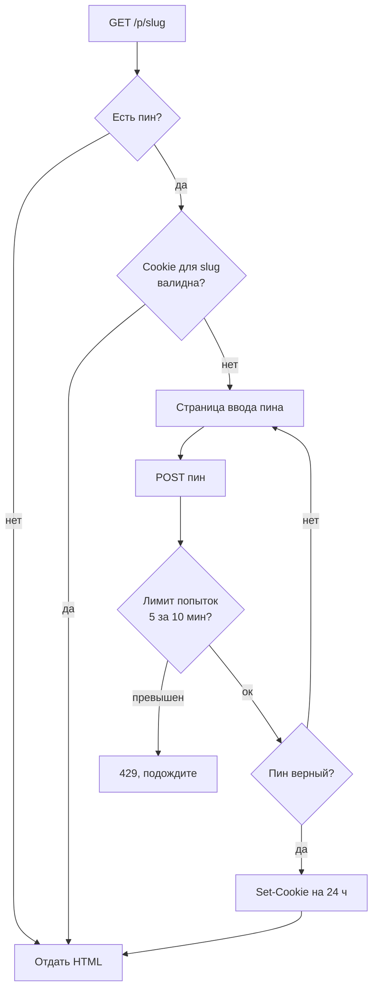

# Home MCP Hub — архитектура и план

Sep 24, 2026 · @Evan

## Цель и рамки

Строим один Docker-контейнер «hub» на NAS: внутри Next.js-приложение, которое одновременно отдаёт MCP-эндпоинт для Claude (мобильное приложение, custom connector), админку для настройки коннекторов и публичный хостинг HTML-прототипов. Наружу контейнер выходит через Pangolin, авторизация — своя, внутри хаба.

**Что должно работать в первой версии**

- Jackett: найти фильм/сериал, вытащить торрент.
- qBittorrent: статус закачек, добавить, остановить/запустить, удалить.
- TorrServe: добавить торрент и получить ссылку на стрим.
- Прототипы: Claude загружает HTML через MCP, получает ссылку; опционально пинкод на просмотр.
- Админка: URL, пароли и настройки каждого сервиса, журнал вызовов, управление доступом Claude.

**Рамки и допущения**

- Один пользователь (ты) — один аккаунт админа, одна подключённая учётка Claude. Ролей и приглашений нет.
- Jackett, qBittorrent и TorrServe уже крутятся на NAS в локальной сети и снаружи не видны — хаб ходит к ним по LAN.
- Хаб торчит в интернет целиком, поэтому каждый публичный путь защищён: MCP — OAuth, админка — логин + 2FA, прототипы — пинкод по желанию.
- Список коннекторов будет расти, значит коннектор — это отдельный модуль по одному шаблону, а не код, размазанный по проекту.
- Глубина здесь — «что умеет каждый сервис»; точные схемы параметров инструментов пишем на этапе кода.

## Общая архитектура

Один процесс Next.js делает всё: MCP-эндпоинт, OAuth-сервер, админку и раздачу прототипов. Отдельных сервисов не нужно — состояние лежит в SQLite и папке с прототипами на томе `/data`.



Все три вида трафика входят через один домен и один ресурс Pangolin; кто есть кто, решает сам хаб по пути и токену.

**Как ходит запрос «найди и поставь на закачку»**



Ключевая идея — `result_id`: Claude никогда не видит ссылки Jackett (в них зашит его API-ключ) и не перепечатывает магнеты на 300 символов. Хаб хранит результат поиска в кэше около часа и сам подставляет ссылку при добавлении в qBittorrent или TorrServe.

**Компоненты внутри hub**

| Компонент | Путь | Что делает |
| --- | --- | --- |
| MCP-эндпоинт | `POST /{secret}/api/mcp` | Streamable HTTP без сессий; принимает вызовы tools, проверяет токен |
| OAuth-сервер | `/{secret}/api/auth/oauth2/*`, well-known с `{secret}` в пути | Выдаёт Claude токены после твоего логина; регистрация клиента, PKCE |
| Админка | `/{secret}/admin/*` | Коннекторы, прототипы, доступ Claude, журнал, настройки |
| Прототипы | `/p/{slug}` — без префикса | Отдаёт загруженный HTML, спрашивает пинкод, если он задан |
| Реестр коннекторов | код, `lib/connectors/*` | Один модуль на сервис: схема настроек, проверка связи, набор tools |
| Хранилище | `/data/hub.db`, `/data/prototypes/` | SQLite и файлы; секреты в БД зашифрованы |

## Авторизация

Три разных контура защиты, и все три живут в хабе. Pangolin только терминирует TLS и прокидывает трафик — его собственная авторизация на ресурсе выключена.

| Контур | Кто ходит | Механизм |
| --- | --- | --- |
| `/{secret}/api/mcp` | Claude | Секретный префикс в пути + OAuth 2.1 (PKCE S256), Bearer-токен в каждом запросе, проверка `aud` |
| `/{secret}/admin/*`, `/{secret}/login` | Ты | Секретный префикс + логин и пароль, второй фактор (TOTP или passkey), сессионная cookie |
| `/p/{slug}` | Кто угодно со ссылкой | Без префикса: случайный slug + опциональный пинкод, подписанная cookie после ввода |

**Claude ↔ хаб: что требует Claude**

По [документации custom connectors](https://claude.com/docs/connectors/building/authentication) из коробки поддержаны OAuth с динамической регистрацией клиента (DCR), вариант «свой client ID» и режим без авторизации. Статичный заголовок с API-ключом — бета для ограниченного круга организаций, на него не рассчитываем. Значит, хаб сам становится OAuth-сервером. Что он обязан отдавать:

- На запрос без токена — `401` с `WWW-Authenticate: Bearer resource_metadata="…"`.
- `/.well-known/oauth-protected-resource` (RFC 9728): поле `resource` ровно тот URL, что введён в Claude, и адрес authorization server.
- `/.well-known/oauth-authorization-server` (RFC 8414): endpoints authorize/token/register, `code_challenge_methods_supported: ["S256"]`.
- Redirect URI клиента Claude: `https://claude.ai/api/mcp/auth_callback` (один для web, desktop и mobile).
- Discovery, registration и token должны отвечать за 10 с; редиректов на другой хост быть не должно; сервер нужен на публичном IPv4 — Pangolin VPS это закрывает.

Всё это даёт плагин `@better-auth/mcp` (на базе `@better-auth/oauth-provider`) — писать OAuth-сервер руками не нужно. Поток подключения:



**Решения по OAuth**

- DCR включён, но регистрация клиента ничего не даёт без твоего логина на экране согласия. Переключатель в админке «разрешить регистрацию новых клиентов» — включил, подключил Claude, выключил.
- Redirect URI ограничен списком: только `https://claude.ai/api/mcp/auth_callback`. Чужой клиент с другим redirect токен не получит.
- Access-токен живёт 1 час, refresh — 30 дней; все токены и клиенты видны и отзываются в админке.
- Один общий scope `hub` — разграничение по коннекторам не нужно при одном пользователе.
- Важно: в Claude настройки авторизации коннектора нельзя поменять после добавления — только удалить и добавить заново.

**Секретный префикс пути**

Весь хаб живёт под случайным префиксом: `https://hub.example.com/gfgsfv2rfd/api/mcp`, `…/gfgsfv2rfd/admin`, `…/gfgsfv2rfd/login`, `…/gfgsfv2rfd/api/auth/oauth2/*`. Без префикса только прототипы `/p/{slug}` — их ссылки уходят другим людям и не должны ломаться при смене префикса. Корень, `/admin`, `/login`, `/api/mcp` и любой неверный префикс отвечают пустым 404 — снаружи домен выглядит как пустой сайт с несколькими прототипами.

- Префикс — 12–16 случайных символов base62, хранится в таблице `setting`, меняется на экране «Доступ Claude» (сгенерировать или ввести свой). Первый генерируется при первом запуске и печатается в лог контейнера, иначе в админку не попасть.
- Реализация — `middleware.ts`: `/{x}/…` при совпадении `x` с префиксом (сравнение за постоянное время) переписывается на внутренний `/…`; `/p/*`, `/_next/static/*` (хешированные ассеты, не угадываются) и `/.well-known/*/{secret}…` проходят как есть; остальное — 404. Все ссылки и редиректы админки строятся через хелпер `href()`, который подставляет префикс; better-auth получает `baseURL = https://hub.example.com/{secret}` и сам ставит его в свои редиректы и метаданные (инстанс пересоздаётся при смене префикса — или просто рестарт контейнера, на NAS это секунды).
- OAuth-discovery без утечки префикса: на 401 хаб отдаёт `WWW-Authenticate: Bearer resource_metadata="https://hub.example.com/{secret}/.well-known/oauth-protected-resource"` — Claude разрешает любой HTTPS-адрес для этого документа. В нём `resource` = `https://hub.example.com/{secret}/api/mcp`, `authorization_servers` = `["https://hub.example.com/{secret}"]`. Корневые `/.well-known/*` — 404.
- Метаданные authorization server для issuer с путём хаб отдаёт одним и тем же JSON по всем трём адресам, которые предписывает MCP-спека: `/.well-known/oauth-authorization-server/{secret}` (RFC 8414), `/.well-known/openid-configuration/{secret}` и `/{secret}/.well-known/openid-configuration`. Внутри `issuer` = `https://hub.example.com/{secret}`, endpoints под `/{secret}/api/auth/oauth2/*`.
- Это единственное место, где есть риск: документация Claude не говорит прямо, как он ищет метаданные для issuer с путём (спека обязывает клиентов пробовать все три). Проверяется одним реальным подключением на этапе 2. Запасной вариант, если Claude смотрит только в корень: OAuth-часть (`/login`, `/consent`, `/api/auth/oauth2/*`, корневые well-known) остаётся без префикса, а админка и MCP — под ним.
- Смена префикса: админка показывает новые ссылки и перебрасывает на них (cookie сессии с путём `/` переживает смену), токены Claude отзываются (новый `resource`), коннектор в Claude пересоздаётся с новым URL, прототипы не трогаются.
- Это защита в глубину, не замена OAuth и 2FA: префикс виден в логах Traefik, в настройках Claude и в истории браузера. Зато страница логина не находится сканерами — в журнале не будет чужих попыток входа.

**Админка**

Тот же better-auth: email + пароль, плагин `twoFactor` (TOTP) или `passkey`. Регистрация закрыта: единственный админ создаётся при первом запуске из переменных окружения `ADMIN_EMAIL` / `ADMIN_PASSWORD`, потом пароль меняется в настройках. Экран согласия OAuth использует эту же сессию, поэтому второй фактор автоматически защищает и выдачу токенов Claude.

**Что делает Pangolin и чего не делает**

- Ресурс `hub.твой-домен` создаётся с выключенной авторизацией Pangolin. Иначе Claude упрётся в страницу логина Pangolin, а гости не откроют прототип.
- Правила «Bypass Auth» по пути в Pangolin есть, но были жалобы, что они не срабатывают для неавторизованных на защищённых ресурсах ([issue #2551](https://github.com/fosrl/pangolin/issues/2551)). Надёжнее не зависеть от них.
- Правила Deny по стране/ASN работают независимо от авторизации — их можно использовать как грубый фильтр (Claude ходит с американских IP `160.79.104.0/21`, ты — со своих).
- Дополнительно хаб сам может пускать на `/api/mcp` только с диапазона Claude (настройка «разрешённые CIDR», по `X-Forwarded-For` от Traefik). Это защита в глубину, а не замена OAuth.

**Альтернативы, которые отложены**

- Внешний IdP (Keycloak, Authentik) — ещё один контейнер и настройка DCR-политик ради одного пользователя; имеет смысл, если появятся другие сервисы с SSO.
- Режим «без авторизации» + секретный путь — проще на вечер, но секрет в URL утекает в логи и его нельзя отозвать отдельно от адреса. Не для сервиса, который управляет закачками на NAS.

## Стек и структура проекта

Next.js (App Router) как единственный рантайм: админка рендерится на сервере, MCP и OAuth — обычные route handlers. Версии актуальны на сентябрь 2026.

| Слой | Выбор | Почему |
| --- | --- | --- |
| Фреймворк | Next.js 15+, TypeScript, `output: 'standalone'` | Один образ, маленький Docker, админка и API в одном месте |
| MCP | [`mcp-handler`](https://github.com/vercel/mcp-handler) 2.x + `@modelcontextprotocol/server` 2.x | `createMcpHandler` сразу для App Router, stateless Streamable HTTP, Redis больше не нужен |
| Авторизация | [`better-auth`](https://better-auth.com/docs/plugins/mcp) 1.7 + `@better-auth/mcp`, `twoFactor` | Логин админа и OAuth-сервер для Claude из одной библиотеки; `requireMcpAuth` оборачивает MCP-route |
| БД | SQLite (`better-sqlite3`) + Drizzle ORM | Один файл на томе `/data`, миграции в репо, никакого отдельного сервера БД |
| UI | Tailwind + shadcn/ui | Быстро собрать формы, таблицы, drawer'ы; тёмная тема из коробки |
| Валидация | zod | Одна схема для формы коннектора в админке и для параметров tools |
| Секреты | AES-256-GCM, ключ из `HUB_MASTER_KEY` | Пароли сервисов в БД не лежат открытым текстом |
| Логи | pino в stdout + таблица `tool_call` | Docker собирает stdout, админка показывает журнал вызовов |

Нюанс про версии: в сентябре 2026 вышли SDK v2 и better-auth 1.7 с переименованиями (`withMcpAuth` → `requireMcpAuth`, эндпоинты `/mcp/*` → `/oauth2/*`). Старые примеры в интернете будут с v1-API — ориентироваться на текущие README обеих библиотек.

**Дерево проекта**

```
hub/
├─ .github/workflows/docker.yml   сборка образа и push в GHCR на каждый push в main
├─ middleware.ts           /{secret}/… → /…; /p/*, /_next/static/* и well-known с {secret} — как есть; остальное 404
├─ instrumentation.ts      старт планировщика (node-cron): health-check, чистка прототипов и кэша
├─ app/
│  ├─ (public)/
│  │  ├─ login/            /{secret}/login — вход + 2FA
│  │  ├─ consent/          /{secret}/consent — «разрешить Claude»
│  │  └─ p/[slug]/         /p/{slug} — прототип без префикса: пинкод → HTML
│  ├─ admin/               /{secret}/admin/*
│  │  ├─ page.tsx          дашборд
│  │  ├─ connectors/       список + форма настройки
│  │  ├─ prototypes/       список + карточка
│  │  ├─ access/           секретный префикс, клиенты, токены
│  │  ├─ activity/         журнал вызовов
│  │  └─ settings/         пароль, 2FA, base URL, ключи
│  ├─ api/
│  │  ├─ auth/[...all]/    /{secret}/api/auth/* — better-auth (логин, /oauth2/*)
│  │  └─ mcp/route.ts      /{secret}/api/mcp — requireMcpAuth(createMcpHandler(...))
│  ├─ [secret]/.well-known/
│  │  ├─ oauth-protected-resource/     PRM (на него указывает 401)
│  │  └─ openid-configuration/         AS metadata, вариант path-append
│  └─ .well-known/
│     ├─ oauth-authorization-server/[secret]/   AS metadata, RFC 8414
│     └─ openid-configuration/[secret]/         AS metadata, вариант path-insert
├─ lib/
│  ├─ auth.ts              конфиг better-auth, baseURL с префиксом
│  ├─ prefix.ts            текущий префикс, href(), сравнение
│  ├─ jobs.ts              фоновые задачи
│  ├─ db/                  drizzle schema + migrations
│  ├─ crypto.ts            шифрование секретов
│  ├─ mcp/
│  │  ├─ server.ts         собирает tools из включённых коннекторов, instructions
│  │  └─ result-cache.ts   result_id → ссылка
│  └─ connectors/
│     ├─ types.ts          интерфейс Connector
│     ├─ registry.ts       список всех коннекторов
│     ├─ jackett/
│     ├─ qbittorrent/
│     ├─ torrserve/
│     └─ prototypes/
├─ Dockerfile
└─ docker-compose.yml       для NAS: image из GHCR + newt
```

**Контракт коннектора** — то, что делает расширение дешёвым. Каждый модуль экспортирует один объект:

```ts
export const jackett: Connector = {
  id: 'jackett',
  name: 'Jackett',
  configSchema: z.object({ baseUrl: z.string().url(), apiKey: secret() }),
  test: async (cfg) => { /* GET /api/v2.0/indexers?configured=true */ },
  tools: (cfg) => [searchTorrents(cfg), listIndexers(cfg)],
}
```

Админка рисует форму по `configSchema` (поля с маркером `secret()` шифруются и показываются маской), кнопка «Проверить» зовёт `test`, а MCP-сервер при каждом запросе собирает `tools` только из включённых и настроенных коннекторов. Новый сервис = одна папка и одна строка в `registry.ts`.

## Коннекторы и возможности MCP

Пять коннекторов, около 18 инструментов. Правило для всех: ответ короткий и читаемый (Claude покажет его тебе на телефоне), разрушающие действия требуют явного флага подтверждения, секреты и служебные ссылки в ответ не попадают.

**Jackett — поиск**

| Инструмент | Что умеет |
| --- | --- |
| `search_torrents` | Запрос + тип (фильм / сериал / любое), сезон/серия, минимум сидов, лимит. Возвращает топ-N с `result_id`, названием, размером, сидами, трекером, датой и распарсенным качеством (1080p, WEB-DL, дубляж) |
| `list_indexers` | Какие трекеры настроены и живы — чтобы понять, почему ничего не нашлось |

Хаб ходит в JSON-эндпоинт Jackett (`/api/v2.0/indexers/all/results`) и мапит тип на категории Torznab (2000 фильмы, 5000 сериалы, 5070 аниме). Ссылки `Link`/`MagnetUri` остаются в кэше под `result_id`; для приватных трекеров магнета обычно нет, и хаб сам скачивает `.torrent` через Jackett и отдаёт его файлом в qBittorrent.

**qBittorrent — закачки**

| Инструмент | Что умеет |
| --- | --- |
| `torrents_status` | Список с фильтром (активные / качаются / готовы / остановлены / ошибки), категорией и лимитом: имя, прогресс, скорость, ETA, сиды, состояние |
| `torrent_add` | По `result_id` из поиска или по магнету/URL; категория, папка, «добавить остановленным» |
| `torrent_stop` / `torrent_start` | Пауза и возобновление по hash или «все» |
| `torrent_delete` | Удалить из списка; файлы с диска — только с флагом `delete_files: true` и `confirm: true` |
| `torrent_files` | Файлы внутри торрента с прогрессом — полезно для сезонов |
| `transfer_info` | Общая скорость, состояние соединения, свободное место на диске |

Что учесть по API qBittorrent 5.x ([wiki](<https://github.com/qbittorrent/qBittorrent/wiki/WebUI-API-(qBittorrent-5.0)>)): эндпоинты паузы теперь `torrents/stop` и `torrents/start` (старые `pause`/`resume` отдают 404), параметр добавления — `stopped`, а не `paused`; состояния `stoppedDL/stoppedUP`. Способ входа в коннекторе — один из трёх: **без авторизации** (в qBittorrent включено «Пропускать аутентификацию для клиентов в подсетях» с подсетью docker-сети хаба — именно её, а не localhost: хаб приходит из другого контейнера; админка подсказывает свой IP и подсеть), **API-ключ** (5.2+, `Authorization: Bearer`) или **логин и пароль** (заголовок `Referer`, имя cookie в 5.2 стало `QBT_SID_<port>` — брать из `Set-Cookie`, не хардкодить). Для сервиса, который виден только из локальной сети, первый вариант проще всего и не требует хранить секреты. Тот же принцип у TorrServe: Basic-auth там включается флагом `--httpauth`, по умолчанию его нет, и коннектор тоже предлагает «без авторизации» или «логин и пароль»; Jackett без API-ключа не работает.

**TorrServe — стриминг**

| Инструмент | Что умеет |
| --- | --- |
| `torrserve_add` | Добавить по `result_id` или магнету, с названием и постером, сохранить в базу TorrServe |
| `torrserve_list` | Что уже добавлено, состояние, файлы внутри |
| `torrserve_links` | Ссылки на плейлист M3U и прямой стрим файла — чтобы открыть на телевизоре или в плеере |
| `torrserve_remove` | Убрать торрент из базы |

API — `POST /torrents` с JSON `{action: add|list|rem, link, title, poster, save_to_db}`, Basic-auth из `accs.db`, версия через `GET /echo` ([README](https://github.com/YouROK/TorrServer/blob/master/README.md)). Ссылки на стрим ведут на домашний адрес TorrServe — работают из домашней сети или по VPN, снаружи TorrServe не публикуем.

**Прототипы**

| Инструмент | Что умеет |
| --- | --- |
| `prototype_publish` | Принимает HTML, название, опциональный пинкод и срок жизни; возвращает публичную ссылку |
| `prototype_update` | Заменить HTML по тому же slug (ссылка не меняется), поставить/снять пинкод, продлить срок |
| `prototype_list` | Список с ссылками, датами и числом просмотров |
| `prototype_delete` | Удалить |

**Служебные**

| Инструмент | Что умеет |
| --- | --- |
| `hub_status` | Какие коннекторы включены и отвечают, версии сервисов, время последней проверки — первый инструмент для отладки подключения |

Типичный сценарий с телефона: «найди второй сезон X в 1080p и поставь на закачку» → `search_torrents` → Claude выбирает релиз или спрашивает тебя → `torrent_add(result_id)` → через час «как там закачка?» → `torrents_status`.

## Хостинг прототипов

Прототип — один самодостаточный HTML-файл, который Claude передаёт в `prototype_publish`; хаб кладёт его в `/data/prototypes/{id}/index.html` и отдаёт по адресу `https://hub.домен/p/{slug}`. Slug — 8–10 случайных символов, чтобы ссылку нельзя было угадать. Это единственный путь хаба без секретного префикса: ссылки на прототипы раздаются другим людям и переживают смену префикса.

**Пинкод**



- Пин — 4–8 цифр, хранится как хэш (argon2), в админке можно только задать новый, не посмотреть старый.
- Cookie подписана секретом хаба и привязана к конкретному slug и версии пина — сменил пин, старые cookie перестали работать.
- Лимит попыток считается по IP и по slug, чтобы пин из 4 цифр нельзя было перебрать.

**Изоляция от админки**

Прототипы и админка живут на одном домене, а в прототипе произвольный JavaScript. Чтобы он не мог читать cookie админки, HTML отдаётся с заголовком `Content-Security-Policy: sandbox allow-scripts allow-forms allow-modals allow-popups` без `allow-same-origin` — браузер считает страницу «ничейной» (opaque origin), и доступа к cookie, localStorage и fetch на `/admin` у неё нет. Скрипты, стили и CDN при этом работают. Если какому-то прототипу понадобится localStorage, второй шаг — отдельный поддомен `p.домен` вторым ресурсом в Pangolin.

**Лимиты и жизненный цикл**

| Параметр | Значение по умолчанию |
| --- | --- |
| Размер HTML | до 5 МБ (картинки — data-URI внутри) |
| Срок жизни | бессрочно; через параметр — 7 / 30 дней, потом 410 Gone и удаление файла фоновой задачей |
| Версии | хранить последние 3 версии, откат из админки |
| Счётчик просмотров | число открытий и дата последнего, без хранения IP |
| Индексация | `X-Robots-Tag: noindex` на всё `/p/*` |

С телефона это выглядит так: Claude собрал страницу, вызвал `prototype_publish` с пином `4821`, вернул ссылку — ты кидаешь её в чат коллеге, пин говоришь голосом.

## Админка

Семь экранов плюс публичная страница пинкода. Одни и те же страницы Next.js адаптивно верстаются под десктоп и телефон: на телефоне сайдбар становится нижними вкладками (Дашборд, Коннекторы, Прототипы, Доступ, Ещё), а формы редактирования открываются отдельными экранами с кнопкой «Назад» и закреплённым «Сохранить». Мокапы всех экранов в обоих вариантах — в [Design-артефакте «Home MCP Hub — админка»](https://claude.ai/artifact/UfzVxgNGz5EjQ114PKiKUx): тёмная тема, шрифты Manrope + IBM Plex Sans, акцент — голубой на графитовом фоне.

| Экран | Путь | Что на нём |
| --- | --- | --- |
| Вход | `/{secret}/login` | Email + пароль, затем код TOTP или passkey |
| Согласие | `/{secret}/consent` | «Claude просит доступ к хабу»: имя клиента, redirect URI, кнопки Разрешить / Отказать |
| Дашборд | `/{secret}/admin` | Карточки здоровья коннекторов, активные закачки, последние вызовы Claude, статус подключения |
| Коннекторы | `/{secret}/admin/connectors` | Список с переключателем вкл/выкл и статусом; форма в боковой панели: URL, секреты маской, дефолты (категория, папка, мин. сиды), кнопка «Проверить соединение» с версией сервиса в ответе, список tools коннектора |
| Прототипы | `/{secret}/admin/prototypes` | Таблица: название, ссылка (копировать / QR), пин вкл/выкл, просмотры, срок, обновлён; карточка с превью, сменой пина, версиями и загрузкой файла вручную |
| Доступ Claude | `/{secret}/admin/access` | Секретный префикс пути и готовый URL для копирования, кнопка «Сгенерировать» с предупреждением о переподключении; инструкция подключения, переключатель регистрации клиентов, список клиентов и активных токенов с кнопкой Отозвать, разрешённые CIDR |
| Журнал | `/{secret}/admin/activity` | Каждый вызов tool: время, инструмент, короткие аргументы, результат, длительность; фильтр по коннектору и ошибкам |
| Настройки | `/{secret}/admin/settings` | Публичный URL, смена пароля, 2FA и passkey, сессии админки, состояние мастер-ключа и JWKS, версия хаба |
| Пинкод | `/p/{slug}` — без префикса | Публичная страница без входа: название прототипа, поле из 4–8 ячеек, ошибка и счётчик попыток; на телефоне — цифровая клавиатура на экране, на десктопе — карточка по центру с вводом с клавиатуры |

Принципы интерфейса: секреты никогда не показываются после сохранения (только «задан, изменить»); каждый коннектор показывает время и результат последней проверки; разрушающие действия (удалить прототип, отозвать токен) — через подтверждение; тёмная тема по умолчанию, как у самих qBittorrent/Jackett.

## Данные и хранение

Один файл SQLite `/data/hub.db` и папка `/data/prototypes/`. Таблицы better-auth (`user`, `session`, `account`, `verification`, `two_factor`, `oauth_client`, `oauth_access_token`, `oauth_refresh_token`, `oauth_consent`, `jwks`) создаёт его CLI; своих таблиц пять.

| Таблица | Поля | Заметки |
| --- | --- | --- |
| `connector` | id, type, name, base\_url, config\_enc, enabled, last\_check\_at, last\_check\_ok, last\_check\_note, updated\_at | `config_enc` — JSON настроек, секретные поля зашифрованы отдельно |
| `prototype` | id, slug, title, pin\_hash, pin\_version, expires\_at, size\_bytes, version, views, last\_viewed\_at, created\_at, updated\_at | файлы в `/data/prototypes/{id}/v{version}.html` |
| `search_result` | id, connector\_id, payload\_json, expires\_at | кэш для `result_id`, TTL 1 ч, чистится при каждом поиске |
| `tool_call` | id, tool, connector\_id, args\_redacted, ok, error, duration\_ms, client\_id, created\_at | журнал; аргументы урезаны до 500 символов, HTML прототипов не пишется |
| `setting` | key, value | base\_url, mcp\_path\_secret, allow\_dcr, allowed\_cidrs, версия схемы |

**Шифрование секретов**

- Мастер-ключ — 32 байта в `HUB_MASTER_KEY` (из `.env` или docker secret), в БД не хранится. Потерял ключ — перевводишь пароли сервисов, остальное цело.
- AES-256-GCM, на каждое значение свой nonce; в БД лежит `v1:<nonce>:<ciphertext>:<tag>`, чтобы потом можно было сменить алгоритм.
- Расшифровка только в момент вызова сервиса; в админку и в ответы MCP секреты не попадают.
- Пинкоды и пароль админа — хэши, не шифрование: их не нужно читать обратно.

## Деплой на NAS и Pangolin

На NAS добавляется один сервис `hub` в тот же compose, где живут Jackett, qBittorrent и TorrServe; Newt (клиент Pangolin) уже там или добавляется рядом. Хаб обращается к сервисам по именам контейнеров внутри docker-сети, наружу смотрит только он.

```yaml
services:
  hub:
    image: ghcr.io/<you>/home-mcp-hub:latest   # собирается в GitHub Actions, NAS только тянет
    restart: unless-stopped
    environment:
      BASE_URL: https://hub.example.com
      HUB_MASTER_KEY: ${HUB_MASTER_KEY}         # openssl rand -hex 32
      BETTER_AUTH_SECRET: ${BETTER_AUTH_SECRET}
      ADMIN_EMAIL: you@example.com
      ADMIN_PASSWORD: ${ADMIN_PASSWORD}         # только для первого запуска
      TRUST_PROXY: "1"
    volumes:
      - ./hub-data:/data
    networks: [media]
    # порт наружу не публикуем — к нему ходит только newt

  newt:
    image: fosrl/newt
    restart: unless-stopped
    environment:
      PANGOLIN_ENDPOINT: https://pangolin.example.com
      NEWT_ID: ${NEWT_ID}
      NEWT_SECRET: ${NEWT_SECRET}
    networks: [media]
```

**Сборка образа — GitHub Actions, не NAS.** Каждый push в `main` собирает образ и публикует в GHCR под тегами `latest` и `sha-<commit>`, тег `v*` — ещё и под версией. На NAS обновление — `docker compose pull && docker compose up -d` (или Watchtower раз в сутки). Dockerfile — стандартный для Next.js standalone: `node:22-alpine`, многостадийная сборка, в финале только `.next/standalone` + `better-sqlite3`; миграции и создание админа запускаются в entrypoint перед `node server.js`. Платформа — `linux/amd64`; если NAS на ARM, добавить `linux/arm64` (нативный модуль `better-sqlite3` собирается под каждую).

```yaml
# .github/workflows/docker.yml
name: docker
on:
  push:
    branches: [main]
    tags: ['v*']
jobs:
  build:
    runs-on: ubuntu-latest
    permissions: { contents: read, packages: write }
    steps:
      - uses: actions/checkout@v4
      - uses: docker/setup-buildx-action@v3
      - uses: docker/login-action@v3
        with: { registry: ghcr.io, username: ${{ github.actor }}, password: ${{ secrets.GITHUB_TOKEN }} }
      - uses: docker/metadata-action@v5
        id: meta
        with:
          images: ghcr.io/${{ github.repository }}
          tags: |
            type=raw,value=latest,enable={{is_default_branch}}
            type=sha,prefix=sha-
            type=semver,pattern={{version}}
      - uses: docker/build-push-action@v6
        with:
          context: .
          platforms: linux/amd64
          push: true
          tags: ${{ steps.meta.outputs.tags }}
          cache-from: type=gha
          cache-to: type=gha,mode=max
```

Пакет в GHCR по умолчанию приватный — на NAS один раз `docker login ghcr.io` с personal access token (право `read:packages`), или сделать пакет публичным: секретов в образе нет, они приходят через `.env`.

**Ресурс в Pangolin**

| Параметр | Значение |
| --- | --- |
| Тип | HTTP resource, домен `hub.example.com` |
| Target | сайт NAS → `hub:3000` |
| Authentication | выключена (ни SSO, ни пароль, ни PIN) — авторизует сам хаб |
| Rules | опционально Deny по странам, откуда трафика быть не должно; US не запрещать — оттуда ходит Claude |
| TLS | Let's Encrypt через Traefik на VPS, автоматически |
| Заголовки | Traefik передаёт `X-Forwarded-For/Proto/Host` — хаб им доверяет (`TRUST_PROXY=1`) для правильных redirect и IP в журнале |

Если захочется прикрыть админку ещё и Pangolin SSO — второй ресурс `admin.example.com` на тот же target с включённой авторизацией, а на `hub.example.com` путь `/admin` закрыть в самом хабе по заголовку Host. На старте это лишнее: логин + 2FA + лимит попыток достаточно.

**Подключение в Claude**

1. В админке на экране «Доступ Claude» скопировать готовый URL с секретным префиксом и включить «регистрацию новых клиентов».
2. Claude → Settings → Connectors → Add custom connector: имя «Home Hub», URL `https://hub.example.com/gfgsfv2rfd/api/mcp`, OAuth-поля оставить пустыми.
3. Claude откроет страницу хаба: логин, 2FA, «Разрешить».
4. В чате попросить `hub_status` — если вернулся список коннекторов, всё работает.
5. Выключить регистрацию клиентов обратно.

Коннектор один для всех твоих устройств — мобильное приложение увидит его сразу после добавления в вебе. На бесплатном плане ограничение — один custom connector, на Pro/Max — без ограничений.

## Безопасность

Хаб управляет закачками на домашнем диске и хранит пароли от трёх сервисов — каждый пункт ниже закрывается до того, как ресурс появится в Pangolin.

- [ ] Админ: сильный пароль, включённый второй фактор, лимит 5 попыток логина за 15 мин с IP, регистрация закрыта.
- [ ] Cookie админки: `Secure`, `HttpOnly`, `SameSite=Lax`, префикс `__Host-`; сессия 7 дней с продлением.
- [ ] Секретный префикс: сравнение за постоянное время, пустой 404 на всё без префикса кроме `/p/*`, корневые `/.well-known/*` не выдают его, префикс не пишется в журнал хаба, страницы админки отдаются с `Referrer-Policy: no-referrer`, чтобы он не утекал по внешним ссылкам.
- [ ] OAuth: только PKCE S256, redirect URI из белого списка, проверка `aud` токена = полный URL `/{secret}/api/mcp`, регистрация клиентов выключена после подключения.
- [ ] MCP: только POST, лимит частоты вызовов (60/мин), таймаут на обращение к сервисам 30 с.
- [ ] Разрушающие tools (`torrent_delete` с файлами, `prototype_delete`) требуют `confirm: true`; в описании tool сказано «сначала переспроси пользователя».
- [ ] Секреты сервисов зашифрованы мастер-ключом; ключ и `BETTER_AUTH_SECRET` — в `.env` с правами 600, не в git.
- [ ] Ссылки Jackett с API-ключом и пароли никогда не попадают в ответы tools и в журнал — только `result_id`.
- [ ] Прототипы: CSP sandbox без same-origin, `noindex`, лимит попыток пина, случайный slug, лимит размера.
- [ ] Jackett, qBittorrent, TorrServe не публикуются через Pangolin — наружу смотрит только хаб.
- [ ] Журнал вызовов и логинов хранится 30 дней; неудачные логины видны на дашборде.
- [ ] Заголовки ответов: HSTS, `X-Content-Type-Options: nosniff`, `Referrer-Policy: no-referrer`; админка с CSP без inline-скриптов.
- [ ] Образ обновляется при релизах better-auth и MCP SDK — обе библиотеки быстро меняются (Dependabot или Renovate).

Чего сознательно нет в первой версии: ролей и scope по коннекторам (один пользователь), отдельного поддомена для прототипов (CSP sandbox закрывает риск), WAF.

## Что учесть при реализации

Пять вещей, которые не видны на схеме, но всплывут в первую же неделю кода.

- **Фоновые задачи.** Проверка здоровья коннекторов раз в 2 минуты, удаление истёкших прототипов, чистка кэша `result_id` и журнала старше 30 дней. У Next.js нет планировщика — `instrumentation.ts` при старте процесса запускает `node-cron` в том же контейнере; отдельный worker не нужен.
- **Аннотации и инструкции MCP.** У каждого tool выставить `readOnlyHint` / `destructiveHint` — Claude по ним решает, переспрашивать ли. При инициализации сервера отдать `instructions`: «сначала `search_torrents`, потом `torrent_add(result_id)`; перед удалением с файлами уточни у пользователя; при прочих равных выбирай релизы с русской озвучкой и сидами больше 10». Иначе поведение Claude в каждом чате будет разным.
- **Таймаут Jackett.** Поиск по 14 индексаторам идёт 20–30 с. Хаб ждёт не больше 25 с и отдаёт частичный результат с пометкой, какие трекеры не ответили, вместо ошибки на весь вызов.
- **Размер HTML в аргументе tool.** Стартовый лимит `prototype_publish` — 1 МБ; если Claude упрётся в лимит аргументов, добавить `prototype_append` для докладывания кусками. 5 МБ в разделе про прототипы — лимит хранения, не одного вызова.
- **Точность поиска.** `search_torrents` принимает `imdb_id`, `year`, `language`, склеивает дубли по infohash и отдаёт по одному релизу на трекер и качество — иначе Claude получит десять копий одного релиза.

## План работ

Шесть этапов, каждый заканчивается чем-то, что можно потрогать с телефона. Самый рискованный — второй (OAuth с Claude), поэтому он идёт раньше коннекторов.

| Этап | Что делаем | Готово, когда |
| --- | --- | --- |
| 1. Каркас | Next.js + better-auth + SQLite + Dockerfile, workflow GitHub Actions с публикацией в GHCR, логин админа с 2FA, секретный префикс, пустой дашборд | Образ из GHCR крутится на NAS, вход работает по LAN |
| 2. MCP + OAuth | `/api/mcp` с одним tool `hub_status`, `@better-auth/mcp`, `.well-known`, экран согласия, ресурс в Pangolin | Claude mobile подключён и вызывает `hub_status` |
| 3. Коннекторы | Реестр, форма в админке, шифрование; qBittorrent → Jackett → TorrServe, кэш `result_id` | «найди и скачай» работает с телефона |
| 4. Прототипы | Загрузка, `/p/{slug}`, пинкод, CSP sandbox, экран в админке | Claude публикует страницу, коллега открывает по пину |
| 5. Журнал и доступ | Таблица `tool_call`, экраны Activity и Access, отзыв токенов, фоновые задачи (health-check, чистка) | Видно, что и когда делал Claude |
| 6. Закалка | Чеклист безопасности, rate limits, автообновление образа на NAS, Dependabot | Можно забыть про него на месяц |

**Первые шаги на этапе 2**, где обычно застревают: `curl -i https://hub/{secret}/api/mcp` → 401 с `WWW-Authenticate`, а `curl -i https://hub/api/mcp` и `curl -i https://hub/admin` → 404; `curl https://hub/{secret}/.well-known/oauth-protected-resource` → JSON с точным `resource`; `curl https://hub/.well-known/oauth-authorization-server/{secret}` → `issuer` с префиксом, `registration_endpoint` и `S256`; корневые `/.well-known/*` → 404. Затем одно реальное подключение из Claude — оно покажет, находит ли Claude метаданные для issuer с путём (в логе Traefik будет видно, какие well-known он запросил). Настройки коннектора в Claude потом не правятся, только пересоздаются.

**Идеи на потом**

- Prowlarr вместо или рядом с Jackett: нормальный JSON API с `X-Api-Key`, та же схема категорий — коннектор пишется за вечер.
- Radarr/Sonarr: «добавь сериал в отслеживание» вместо ручного поиска каждой серии.
- Plex/Jellyfin: «что добавилось за неделю», «продолжить смотреть».
- Home Assistant: свет, температура, сцены — у HA есть свой MCP-сервер, его можно проксировать через хаб как ещё один коннектор.
- Уведомления в Telegram, когда закачка завершилась.
- MCP resources/prompts: отдавать Claude готовые подсказки вроде «выбирай релизы с русской озвучкой и сидами > 10», чтобы не повторять в каждом чате.

## Источники

Проверено по состоянию на 24 сентября 2026.

- [Claude: авторизация custom connectors](https://claude.com/docs/connectors/building/authentication) — режимы DCR / свой client ID / без авторизации, redirect URI, таймауты.
- [Claude: добавление remote MCP](https://claude.com/docs/connectors/custom/remote-mcp) и [troubleshooting](https://claude.com/docs/connectors/building/troubleshooting) — требования к сети, диапазон IP, запрет редиректов.
- [Claude: кто может добавлять коннекторы](https://support.claude.com/en/articles/11175166-get-started-with-custom-connectors-using-remote-mcp) — планы и клиенты.
- [MCP spec 2026-07-28: Authorization](https://modelcontextprotocol.io/specification/2026-07-28/basic/authorization) — PRM, RFC 8414, PKCE.
- [mcp-handler](https://github.com/vercel/mcp-handler) и [его гайд по авторизации](https://github.com/vercel/mcp-handler/blob/main/docs/AUTHORIZATION.md) — 2.x, без Redis.
- [MCP TypeScript SDK v2](https://github.com/modelcontextprotocol/typescript-sdk) и [миграция v1→v2](https://ts.sdk.modelcontextprotocol.io/v2/migration/upgrade-to-v2.html).
- [better-auth: MCP plugin](https://better-auth.com/docs/plugins/mcp), [релиз 1.7](https://better-auth.com/blog/1-7), [CHANGELOG @better-auth/mcp](https://github.com/better-auth/better-auth/blob/main/packages/mcp/CHANGELOG.md).
- [Pangolin: авторизация ресурсов](https://docs.pangolin.net/manage/resources/public/authentication), [правила](https://docs.pangolin.net/manage/access-control/rules), [issue #2551 про bypass по пути](https://github.com/fosrl/pangolin/issues/2551).
- [qBittorrent WebUI API 5.0](<https://github.com/qbittorrent/qBittorrent/wiki/WebUI-API-(qBittorrent-5.0)>) и [Changelog](https://github.com/qbittorrent/qBittorrent/blob/master/Changelog) — stop/start, cookie в 5.2, API-ключ.
- [TorrServer README](https://github.com/YouROK/TorrServer/blob/master/README.md) — `/torrents`, Basic auth, `accs.db`.
- [Jackett README](https://github.com/Jackett/Jackett/blob/master/README.md) — Torznab и JSON-эндпоинты, proxy-ссылки `/dl/`.
